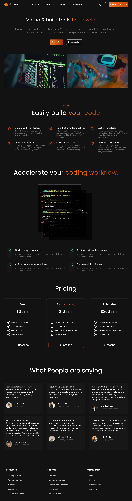

<a name="readme-top"></a>

[MyLinkedIn][linkedin-url]

<br />
<div align="center">
  <h3 align="center">VR App Landing Page</h3>

  <p align="center">
    Step into the Future: Experience VR Like Never Before
    <br />
  </p>
</div>

<!-- TABLE OF CONTENTS -->
<details>
  <summary>Table of Contents</summary>
  <ol>
    <li>
      <a href="#about-the-project">About The Project</a>
      <a href="#built-with">Built With</a>\
    </li>
    <li>
      <a href="#getting-started">Getting Started</a>
      <ul>
        <li><a href="#prerequisites">Prerequisites</a></li>
        <li><a href="#installation">Installation</a></li>
      </ul>
    </li>
    <li><a href="#usage">Usage</a></li>
    <li><a href="#contributing">Contributing</a></li>
  </ol>
</details>

<!-- ABOUT THE PROJECT -->
## About The Project



Welcome to the VR App Landing Page project, a modern and immersive React-based landing page designed to showcase the cutting-edge features and capabilities of your VR application. This project provides a sleek and engaging interface to attract potential users and investors by highlighting the unique aspects of your VR app.

<p align="right">(<a href="#readme-top">back to top</a>)</p>


### Built With

This section should list any major frameworks/libraries used to bootstrap your project. Here are a few examples.

* [React][React-url]
* [Tailwind][Tailwind-url]
* [Lucide React][lucide-react-url]

<p align="right">(<a href="#readme-top">back to top</a>)</p>

<!-- GETTING STARTED -->
## Getting Started

This is an example of how you may give instructions on setting up your project locally.
To get a local copy up and running follow these simple example steps.

### Prerequisites

This is an example of how to list things you need to use the software and how to install them.
* npm
  ```sh
  npm install npm@latest -g
  ```

### Installation

_Below is an example of how you can instruct your audience on installing and setting up your app. This template doesn't rely on any external dependencies or services._

1. Clone the repo
   ```sh
   git clone https://github.com/muhammadderic/vr-landing-page_react_typescript_tailwind.git
   ```
2. Install NPM packages
   ```sh
   npm install
   ```
<p align="right">(<a href="#readme-top">back to top</a>)</p>

<!-- USAGE EXAMPLES -->
## Usage

The client will run in your browser with URL "http://localhost:5173". 

<p align="right">(<a href="#readme-top">back to top</a>)</p>

<!-- CONTRIBUTING -->
## Contributing

Contributions are what make the open source community such an amazing place to learn, inspire, and create. Any contributions you make are **greatly appreciated**.

If you have a suggestion that would make this better, please fork the repo and create a pull request.
Don't forget to give the project a star! Thanks again! :)

1. Fork the Project
2. Create your Feature Branch (`git checkout -b feature/AmazingFeature`)
3. Commit your Changes (`git commit -m 'Add some AmazingFeature'`)
4. Push to the Branch (`git push origin feature/AmazingFeature`)
5. Open a Pull Request

<p align="right">(<a href="#readme-top">back to top</a>)</p>

<!-- MARKDOWN LINKS & IMAGES -->
[linkedin-url]: https://linkedin.com/in/muhammad-donny-ericson
[React-url]: https://create-react-app.dev/
[Tailwind-url]: https://tailwindcss.com/
[lucide-react-url]: https://lucide.dev/